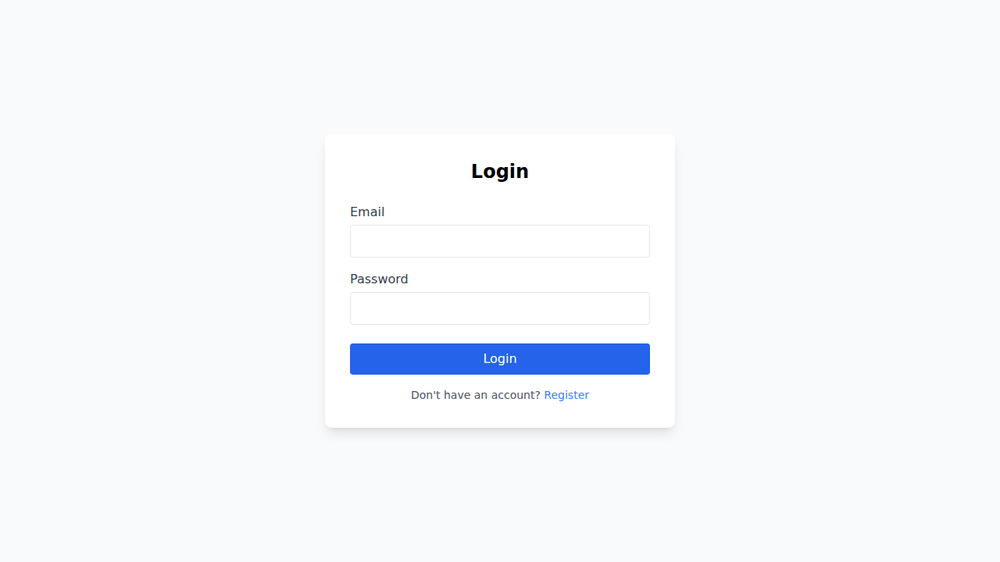
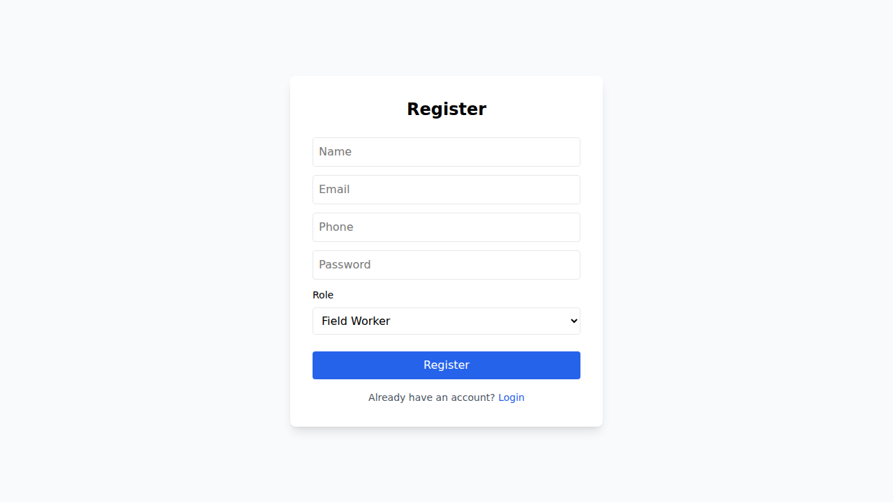

# GeoGuard – Rockfall Prediction & Field Safety Platform

GeoGuard is a full-stack safety platform for mines and high-risk field sites. It combines a **mobile app** (for workers and site teams), a **web dashboard** (for monitoring and administration), a **backend API**, and a **Python ML service** for risk prediction, crack detection, and short-horizon forecasting.

---

## What this repository contains

This repository is organized as a multi-service project:

- **`mobile-app/`** – React Native (Expo) app used by field workers, site admins, government authorities, and super admins.
- **`web-app/`** – Next.js dashboard for monitoring, alerts, complaints, tasks, sensors, ML tools, messaging, and advisory workflows.
- **`backend/`** – Node.js + Express API gateway and real-time event server (Socket.IO).
- **`backend/ml-service/`** – FastAPI service for model inference (`predict`, `detect`, `forecast`).
- **`database/`** – SQL schema for roles, users, slopes, sensors, alerts, complaints, tasks, messages, notifications, advisories, and ML outputs.
- **`connectivity/`** – lightweight alert-system server demo (Express + Socket.IO).
- **`sih2025/`** – model and fusion-engine assets referenced by the ML pipeline.

---

## Core capabilities

- Rockfall/landslide **risk monitoring** across slopes and sensors
- **Real-time alerts** and SOS broadcasting
- **Role-based workflows** (field worker, site admin, government authority, super admin)
- **Complaint/reporting pipeline** with media uploads and feedback loops
- **Task assignment and worker updates**
- **Government advisory publishing**
- **Inter-role messaging**
- **ML-assisted decisions**:
  - risk score prediction
  - crack detection from image uploads
  - 72-hour risk trend forecast

---

## High-level architecture

1. Field and admin users interact via **mobile** and **web** clients.
2. Clients call the **backend API** (`/api/...`) and connect to **Socket.IO** for real-time events.
3. Backend persists operational data to PostgreSQL/PostGIS schema in `database/schema.sql`.
4. Backend forwards ML requests to the **FastAPI ML service** when needed.
5. Alerts, notifications, tasks, advisories, and messaging flow back to clients in near real-time.

---

## Interface snapshots

### Web Login


### Web Register


### Additional screenshot references (provided)
- Login UI: https://github.com/user-attachments/assets/cb14ef18-c511-407c-bb2e-289b49b1d9c5
- Register UI: https://github.com/user-attachments/assets/b4a9c2ba-9a71-4f42-947f-b8aa3090f881

---

## Quick start (local development)

### 1) Backend

```bash
cd backend
npm install
npm run dev
```

Default port: `4000`  
Health check: `GET /health`

### 2) Web app

```bash
cd web-app
npm install
npm run dev
```

Create `web-app/.env.local`:

```env
NEXT_PUBLIC_API_URL=http://localhost:4000/api
NEXT_PUBLIC_SOCKET_URL=http://localhost:4000
```

### 3) Mobile app

```bash
cd mobile-app
npm install
npm start
```

Then run on Android/iOS using Expo commands as needed.

### 4) ML service

```bash
cd backend/ml-service
pip install -r requirements.txt
python main.py
```

Default ML port: `8000`

---

## Technology stack summary

- **Mobile:** React Native, Expo, React Navigation, AsyncStorage, Maps, Charts, Socket.IO client
- **Web:** Next.js 14, React, Tailwind CSS, Leaflet, Chart.js, Zustand
- **Backend:** Node.js, Express, Socket.IO, JWT auth, PostgreSQL (`pg`), Redis support, S3/MinIO support
- **ML service:** FastAPI, XGBoost, TensorFlow, Pandas, NumPy
- **Database:** PostgreSQL + PostGIS schema with operational modules

---

## Current repository state (analysis note)

- The codebase has broad feature coverage across web/mobile/backend/ML.
- Existing docs are spread across multiple files; this `readme.md` serves as a consolidated project-level overview.
- Baseline lint/build checks currently report **pre-existing issues** in web/mobile modules (not introduced by this documentation update).

